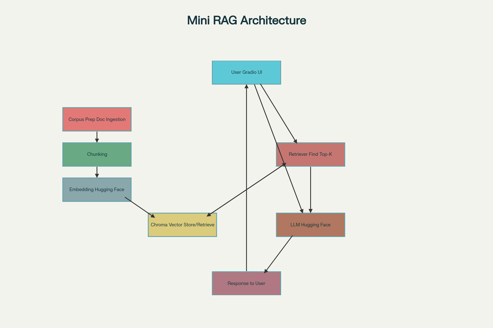

# Mini RAG-Powered Assistant
A modular Retrieval-Augmented Generation chatbot using open-source LLMs, Gradio UI, Hugging Face deployment, and Chroma vector DB for document-based Q&A from custom knowledge sources.


## Features
- Ingest and chunk custom documents (PDF).
- Embedding via Hugging Face models.
- Store/retrieve document vectors with Chroma.
- Query handling and natural answers with LLM.
- User-friendly Gradio web interface.
- One-click deployment to Hugging Face Spaces.


## Tech Stack
- **Front-End:** Gradio (UI)
- **Embeddings:** Hugging Face Transformers (sentence-transformers)
- **Vector Database:** Chroma DB (vector store)
- **Generative Component:** Open-source llm (Meta-llama/Llama 3.2-1B) 
- Python 3.10+

## Architecture



## Workflow (Data Flow)


## Pipeline
### Environment Setup
  - Create a new Python project (use venv or conda).
  - Install essential packages
 ```bash
 pip install gradio transformers chromadb pypdf
```

### Corpus Preparation
- Gather 3–5 documents (PDF) and place them in a data/ folder.
- Load each document (with PyPDF).
- Split the content into manageable text chunks (e.g., 256–512 tokens each).

### Embedding & Vector DB Ingestion
- Choose an embedding model from Hugging Face (e.g., sentence-transformers/all-MiniLM-L6-v2).
- For each chunk, compute embeddings with the Hugging Face model.
- Store each chunk and its embedding in a Chroma vector database, along with metadata (like source and chunk ID).

### Building the RAG Logic
- Query Input: Set up a Gradio chat interface.
- Query Embedding: When a user submits a question, embed it with the same model.
- Similarity Search: Use Chroma to find the k-most similar chunks for the query.
- LLM Integration: Pass the user query and retrieved context to an open-source LLM (e.g., Llama-3, Mistral, Gemma).

### Answer Generation and Display
- The LLM generates an answer using the context and query.
- Display the response in the Gradio interface for the user.

### Deployment
- For local use: `run python app.py` and interact using your browser.

- For cloud/production:
Push the code to Hugging Face Spaces for instant deployment.


